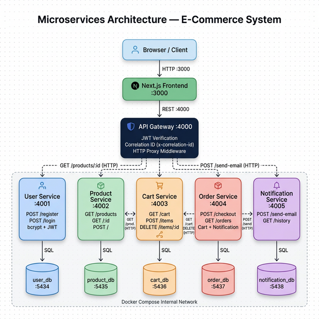
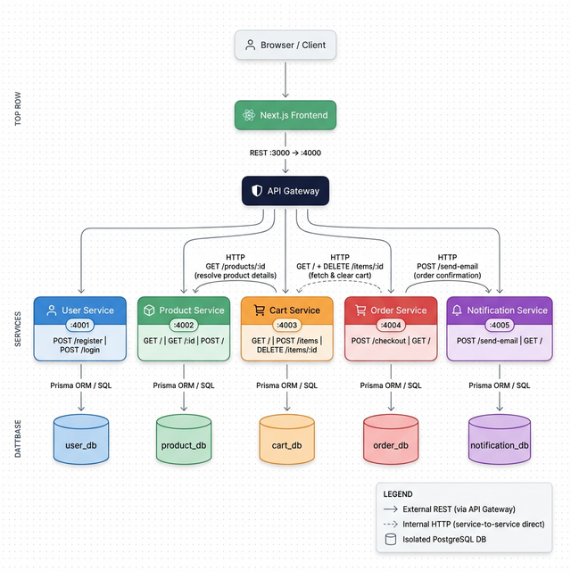
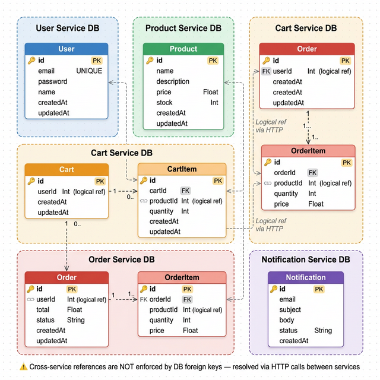
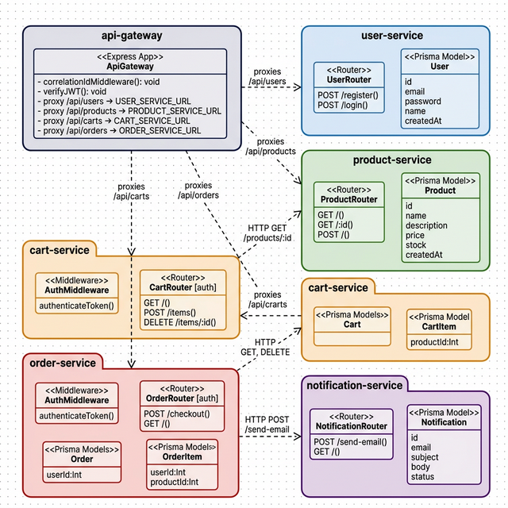
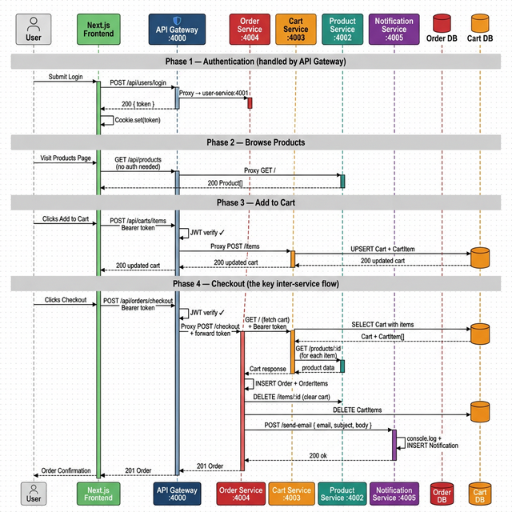
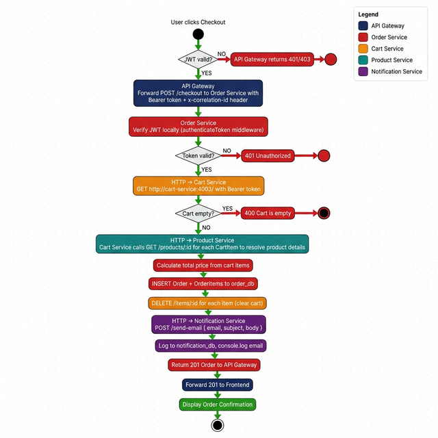

# Microservices E-Commerce — Architecture Diagrams

> All diagrams below cover the **Microservice_Version** e-commerce application: 5 independent services, an API Gateway, and a Next.js frontend — each service with its own isolated PostgreSQL database.

---

## Table of Contents
1. [Architecture Diagram](#1-architecture-diagram)
2. [Microservice Communication Diagram](#2-microservice-communication-diagram)
3. [ERD — Entity Relationship Diagram](#3-erd--entity-relationship-diagram)
4. [Class / Package Diagram](#4-class--package-diagram)
5. [Sequence Diagram](#5-sequence-diagram)
6. [Activity Diagram](#6-activity-diagram)

---

## 1. Architecture Diagram

**What it shows:** How the 13 Docker containers (7 services + 5 databases + 1 frontend) are deployed and interconnected in Docker Compose.

| Container | Technology | External Port | Role |
|---|---|---|---|
| frontend | Next.js | :3000 | UI — talks ONLY to API Gateway |
| api-gateway | Express + http-proxy-middleware | :4000 | Single entry point, JWT check, correlation IDs |
| user-service | Express + Prisma | :4001 | Register & Login |
| product-service | Express + Prisma | :4002 | Product catalog |
| cart-service | Express + Prisma | :4003 | Cart management |
| order-service | Express + Prisma | :4004 | Checkout, calls Cart + Notification |
| notification-service | Express + Prisma | :4005 | Email logging |
| user-db | PostgreSQL 15 | :5434 | Owns: User table |
| product-db | PostgreSQL 15 | :5435 | Owns: Product table |
| cart-db | PostgreSQL 15 | :5436 | Owns: Cart, CartItem |
| order-db | PostgreSQL 15 | :5437 | Owns: Order, OrderItem |
| notification-db | PostgreSQL 15 | :5438 | Owns: Notification |

**Key insights:**
- The **API Gateway is the only public entry point** — the frontend never calls a service directly. All cross-cutting concerns (JWT verification, correlation IDs) live here.
- **Cart Service calls Product Service** over HTTP (internal Docker network URL `http://product-service:4002`) to resolve product details for each CartItem.
- **Order Service calls both Cart Service and Notification Service** — a real orchestration flow with 3 inter-service HTTP calls in a single checkout.
- Each service has its **own isolated database** — no shared tables. This is the fundamental isolation boundary of microservices.

---

## 2. Microservice Communication Diagram

**What it shows:** The **service topology** — how every service connects to every other service. Unlike the Architecture Diagram (which is about Docker containers and ports), this diagram focuses on **who calls whom** at the application level, with the actual API endpoints used for each inter-service call.

| Arrow Type | Meaning |
|---|---|
| Solid vertical arrows | External REST calls routed through the API Gateway |
| Curved dashed arrows | Direct internal HTTP calls between services (bypassing the gateway) |
| Vertical arrows to cylinders | Each service's own private DB via Prisma ORM |

**Key insights:**
- The **API Gateway** is the only node that accepts traffic from the outside world — it fans out to User, Product, Cart, and Order services. The Notification Service is **never directly accessible** from outside (no gateway proxy route for it).
- **Cart Service → Product Service** is an internal synchronous call to resolve product names and prices before returning cart data. This creates a runtime dependency: if Product Service is down, cart reads degrade.
- **Order Service → Cart Service → Product Service** forms a **call chain** during checkout. A failure at any hop bubbles up to the user.
- **Order Service → Notification Service** is the only call that is **wrapped in a try/catch** — meaning notification failures are silently swallowed and do not cause the checkout to fail.
- Notice the Notification Service has **no inbound arrow from the API Gateway** — it is an internal-only service. This is a good microservices pattern (private services not exposed to the internet).

---

## 3. ERD — Entity Relationship Diagram

**What it shows:** Each service's isolated database schema. Intra-service relations use real DB foreign keys; cross-service references are logical (only integers — resolved via HTTP).

| Cross-Service Logical References | How Resolved |
|---|---|
| `CartItem.userId`, `Cart.userId` | JWT token payload (no DB join needed) |
| `CartItem.productId` | Cart Service calls `GET /products/:id` on Product Service |
| `Order.userId` | JWT token payload |
| `OrderItem.productId` | Resolved from cart response during checkout |

**Key insights:**
- **No cross-DB foreign keys exist** — the DB cannot enforce referential integrity across service boundaries. This is intentional; consistency is managed by the application layer.
- The `CartItem` table in cart-db has no `product` relation object — product data is fetched at runtime from another service's network endpoint.
- `Notification` is a **standalone audit table** — it records every sent email independently, giving the notification service its own history without coupling to Order data.
- `OrderItem.price` is still a **price snapshot** — even across service boundaries, the order stores the price-at-purchase to avoid depending on Product Service for historical data.

---

## 4. Class / Package Diagram

**What it shows:** Each microservice as an isolated UML package containing its own routers, middleware, and Prisma models. Inter-package dependencies show HTTP coupling.

**Key insights:**
- **Each package is a separate deployable unit** with its own `PrismaClient`, its own DB, and its own `AuthMiddleware` copy. In the monolith, these were all shared singletons.
- The `api-gateway` package has **no Prisma model** — it is purely a routing/security layer with no DB of its own.
- The `cart-service` package depends on `product-service` via HTTP — this is an **architectural coupling** that would be a candidate for an async event-driven pattern (e.g., caching product data locally) in a production system.
- Both `cart-service` and `order-service` have their own `AuthMiddleware` — JWT verification happens **twice**: once at the gateway and again inside the service.

---

## 5. Sequence Diagram

**What it shows:** The full runtime message flow across all services for the Login → Browse → Add to Cart → Checkout journey, showing all inter-service HTTP calls.

**Key insights:**
- The checkout now involves **9 distinct HTTP calls** across 4 services (vs. 1 process in the monolith). Each hop adds latency and a new failure point.
- The **Correlation ID** (`x-correlation-id` header) injected by the API Gateway flows through all downstream service calls, enabling distributed tracing.
- **Cart Service is called twice** during checkout — once to fetch the cart, once to delete each item. The Order Service orchestrates this synchronously.
- The **JWT Bearer token is forwarded** from the API Gateway through to Cart Service (when Order Service calls it), which is how the cart middleware can authenticate the request — a deliberate design choice that keeps auth consistent.
- The Notification Service is called **last and non-critically** — Order Service wraps it in a try/catch so a notification failure does not roll back the order.

---

## 6. Activity Diagram

**What it shows:** The checkout business logic flow color-coded by which service handles each step, making the distributed nature of the process visible.

**Key insights:**
- **Two layers of JWT verification**: first at the API Gateway (guard), then again inside Order Service (defense in depth). This is different from the monolith's single check.
- The flow spans **4 services** (Order, Cart, Product, Notification) with synchronous HTTP calls forming a chain — this is the classic **orchestration pattern**.
- If **Cart Service or Product Service is down**, the entire checkout fails — a key fragility of synchronous inter-service HTTP. An async (event-driven) approach would decouple this.
- The **Notification step is fault-tolerant** — the activity continues to the success end even if Notification Service fails, because it is wrapped in a try/catch in the Order route handler.
- Order status is set to `"COMPLETED"` (not `"PENDING"` as in the monolith), reflecting that the dedicated Order Service has full ownership of the order lifecycle.

---

## Summary

| Diagram | Scope | Main Insight |
|---|---|---|
| **Architecture** | Deployment / Infrastructure | 13 containers, API Gateway as single entry point, each service owns its DB |
| **Microservice Communication** | Service topology | Who calls whom, internal vs. external routes, private services |
| **ERD** | Data / Database | 5 isolated schemas, no cross-DB FKs, logical refs resolved via HTTP |
| **Class / Package** | Code structure | 6 independent packages, auth middleware duplicated per service |
| **Sequence** | Runtime behavior | 9+ HTTP calls for checkout, JWT forwarded between services, correlation ID tracing |
| **Activity** | Business logic flow | Dual JWT check, synchronous orchestration, fault-tolerant notification step |

---

## Monolith vs. Microservices at a Glance

| Aspect | Monolith | Microservices |
|---|---|---|
| Services | 1 process | 6 services + 1 gateway |
| Databases | 1 shared PostgreSQL | 5 isolated PostgreSQL DBs |
| Auth check | 1 middleware (inline) | API Gateway + each service |
| Checkout HTTP calls | 0 inter-service | 9+ inter-service |
| Notification | `console.log` mock | Real HTTP service with its own DB |
| Failure isolation | None — any bug can crash all features | Services fail independently |
| Complexity | Low | High |
