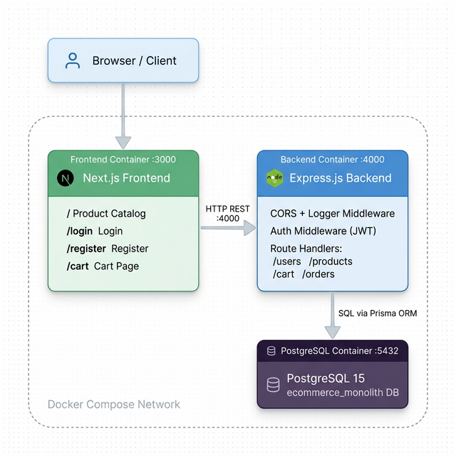
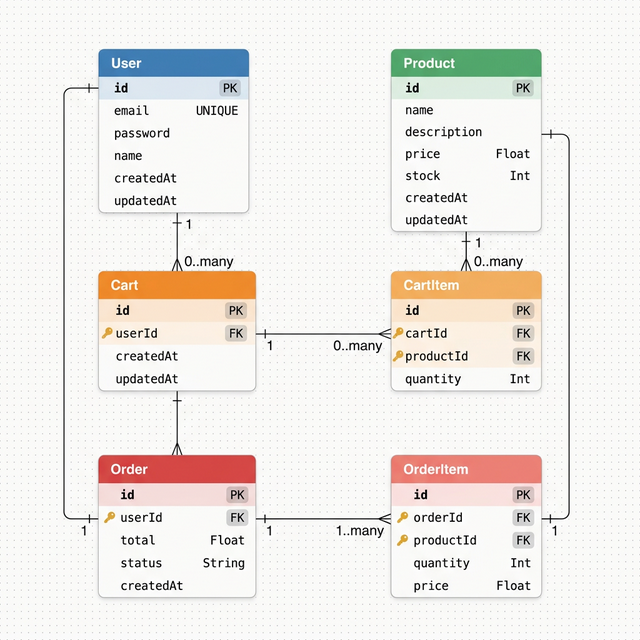
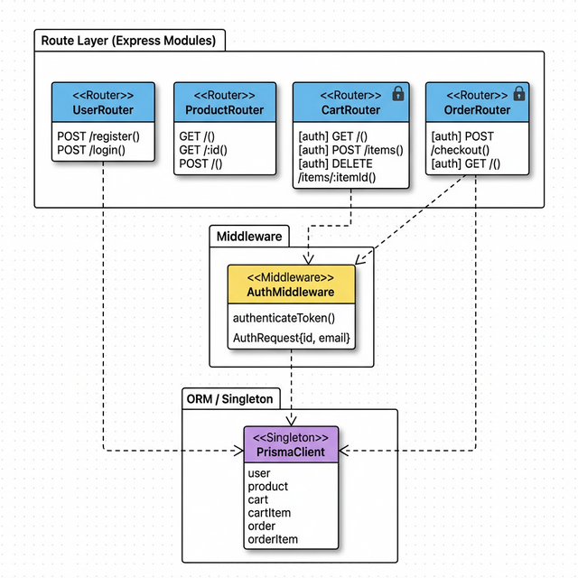
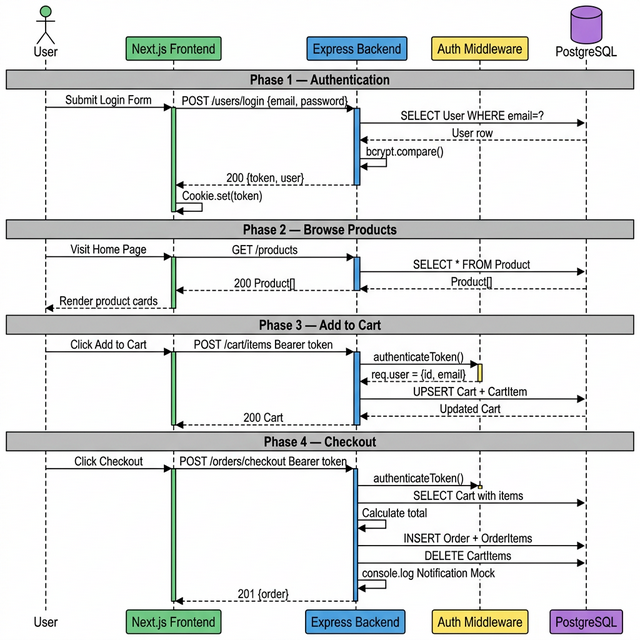
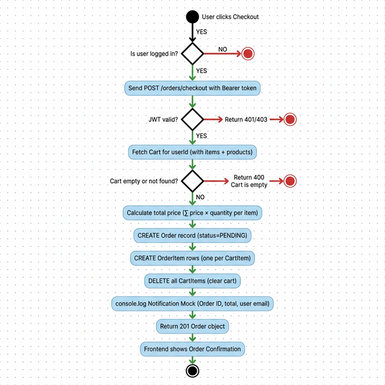

# Monolithic E-Commerce — Architecture Diagrams

> All diagrams below cover the **Monolithic_Version** e-commerce application (Next.js frontend + Express backend + PostgreSQL, deployed with Docker Compose).

---

## Table of Contents
1. [Architecture Diagram](#1-architecture-diagram)
2. [ERD — Entity Relationship Diagram](#2-erd--entity-relationship-diagram)
3. [Class / Package Diagram](#3-class--package-diagram)
4. [Sequence Diagram](#4-sequence-diagram)
5. [Activity Diagram](#5-activity-diagram)

---

## 1. Architecture Diagram

**What it shows:** How the three Docker containers are deployed and connected.

| Layer | Technology | Port |
|---|---|---|
| Frontend | Next.js (React) | :3000 |
| Backend | Express.js + TypeScript | :4000 |
| Database | PostgreSQL 15 | :5432 |

**Key insights:**
- The **entire backend is one single process** — one Express server handles users, products, cart, and orders. There is no API Gateway layer; the browser talks directly to Express.
- Containers are linked via Docker Compose's internal network. The frontend's `axios` calls hardcode `localhost:4000`, so the frontend and backend are tightly coupled at the network level.
- A **single shared database** hosts all domain tables. Any schema migration affects every feature simultaneously.

---

## 2. ERD — Entity Relationship Diagram

**What it shows:** All 6 Prisma models mapped to database tables with their columns and foreign-key relationships (crow's foot notation).

| Relationship | Cardinality | Key |
|---|---|---|
| User → Cart | 1 : 0..many | Cart.userId FK |
| User → Order | 1 : 0..many | Order.userId FK |
| Cart → CartItem | 1 : 0..many | CartItem.cartId FK + CASCADE DELETE |
| Product → CartItem | 1 : 0..many | CartItem.productId FK |
| Order → OrderItem | 1 : 1..many | OrderItem.orderId FK + CASCADE DELETE |
| Product → OrderItem | 1 : 0..many | OrderItem.productId FK |

**Key insights:**
- `Product` is a **shared reference table** — it appears in both `CartItem` and `OrderItem`. In microservices this would be split across service boundaries (a Product Service with its own DB).
- `OrderItem` stores a **snapshot of the price at purchase time** (`price Float`), decoupling it from future product price changes. This is a good design pattern even in a monolith.
- `Cart` has no `status` field — a user has at most one active cart found via `findFirst`.

---

## 3. Class / Package Diagram

**What it shows:** The Express route modules as UML class/package boxes, their methods, and their dependencies on `AuthMiddleware` and `PrismaClient`.

**Key insights:**
- `CartRouter` and `OrderRouter` are **protected** — they apply `authenticateToken` middleware before every handler. `ProductRouter` and `UserRouter` are public.
- All four routers share **one PrismaClient singleton** (`src/db.ts`), meaning they share the same connection pool — a typical monolith characteristic that would need to be split per-service in a microservices architecture.
- `AuthMiddleware` extends Express's `Request` with a custom `AuthRequest` interface that adds `req.user: { id, email }` after JWT verification.

---

## 4. Sequence Diagram

**What it shows:** The full runtime message flow across 4 phases — Login → Browse Products → Add to Cart → Checkout.

**Key insights:**
- All 4 phases communicate with **the same backend process** — there are no inter-service HTTP calls. Everything resolves within one Express handler hitting one Postgres database.
- The **JWT flow** is stateless: no session store or Redis is needed. The token payload carries `{ id, email }` and is re-verified on every protected request.
- The "Notification Mock" at checkout is a `console.log` inside the order route — a natural **seam point** where an async event publisher (e.g., RabbitMQ) would be introduced in the microservices version.

---

## 5. Activity Diagram

**What it shows:** The decision logic and sequential steps of the `POST /orders/checkout` handler from user click to order confirmation.

**Key insights:**
- Three **guard clauses** run before any business logic: auth check → JWT verify → cart-empty check. Early exits return 4xx errors immediately.
- The happy path is fully **synchronous and sequential**: calculate → create order → create order items → clear cart → mock notify → respond. No queues, no async events.
- `status: 'PENDING'` is set at creation and is **never updated** in this codebase — marking a clear feature gap that would be a separate Order Status Service in a mature architecture.

---

## Summary

| Diagram | Scope | Main Insight |
|---|---|---|
| **Architecture** | Deployment / Infrastructure | Single Express process, 3 Docker containers, direct REST coupling |
| **ERD** | Data / Database | 6 shared tables, Product referenced cross-domain, price snapshot on OrderItem |
| **Class / Package** | Code structure | 4 route modules, shared PrismaClient singleton, auth middleware dependency |
| **Sequence** | Runtime behavior | All operations in one process, stateless JWT, mocked notification |
| **Activity** | Business logic flow | Guard-clause-first, fully synchronous checkout, PENDING status never updated |
